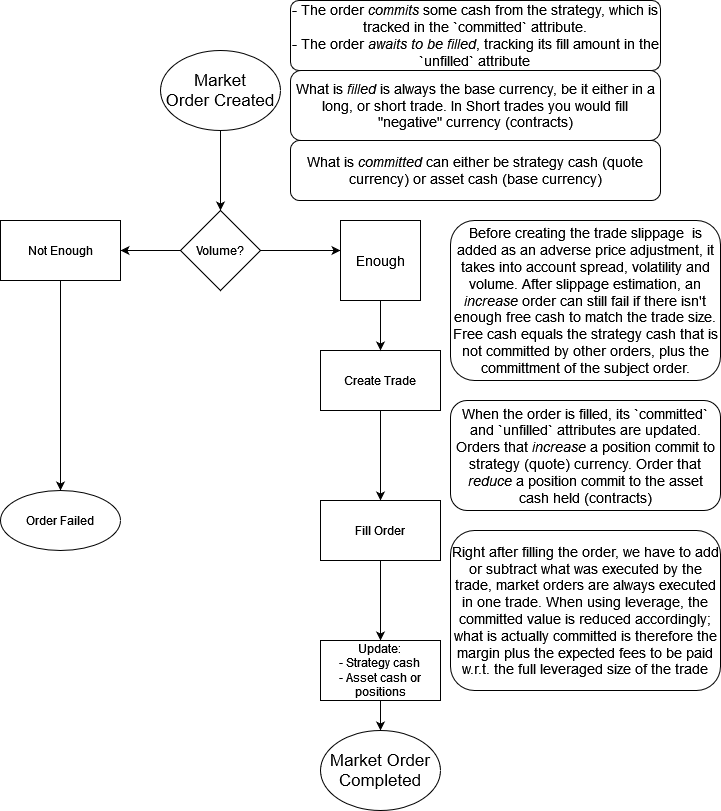

## Precompilation

Functions that should be precompiled
Precompilation can be skipped for some modules, by setting `JULIA_NOPRECOMP` env var:

```julia
ENV["JULIA_NOPRECOMP"] = (:PingPong, :Scrapers, :Engine, :Watchers, :Plotting, :Stats)
```

or use direnv, (see the `.envrc` in the repository).
Setting `JULIA_NOPRECOMP=all` disables precompilation _entirely_ for some packages, it should be used only when modifying low level pieces of the modules stack.
When switching between `all`, and custom lists remember to purge the compile cache:

```julia
include("resolve.jl")
purge_compilecache() # If you pass a local package name it will only purge that package comp cache
```

The packages `Exchanges` and `Fetch` have a `compile.jl` file that can be used to generate precompile statements through [CompileBot.jl](https://github.com/aminya/CompileBot.jl). This is useful when the precompilation workload does many web requests. However this method is currently disabled because it does not seem to compile as many method as `PrecompileTools`.

!!! warning "Custom precompilation"
    When precompiling your own custom methods ensure to fence the code with `py_start_loop` and `py_stop_loop` from the python package. This is necessary to avoid Pkg stalling (Pkg can stall if there are threads lingering).
    ```julia
    using PrecompileTools
    Python.py_stop_loop() # if the python loop is already running stop it
    Python.py_start_loop()
    @precompile_workload $(myworkload...)
    Python.py_stop_loop()
    ```

## Methods invalidations

The sequence of `using ...` statements to load modules can be important to consider, although only for the first instance for a particular module is critical. That's because when a module is loaded, methods insertion can trigger invalidation. If you order the modules loading from the _most_ likley to invalidate, to the _least_ one, less methods will be invalidated and the top module will load faster.
For example in case of modules that depend on the `Python`, making python the top most statemenet can improve loading times, e.g.:

```julia
# load invalidation heavy modules first
using Python
using Ccxt
# load lightweight modules later
using Timeticks
using Lang
```

Invalidation heavy modules list:

- Python
- Ccxt (starts the python async loop)
- Data (depends on Zarr and DataFrames)
- Plots (makie dependency)

In general if one of our local package depends on some heavy package, the chances that it will trigger many methods invalidations is high. This is also why it is important to always add an external module to 1 and only 1 local package and use the local package as dependency to other local packages, e.g.:

We choose to make `DataFrames` a dependency to the local package `Data`, but we want to use the `DataFrames` module from our `Stats` package. We should _not_ add `DataFrames` the deps of `Stats`, instead we `Data` and import `DataFrames` from `Data` like so:

```julia
module Stats

using Data.DataFrames

# ...
end
```

### Segfaults
See https://github.com/cjdoris/PythonCall.jl/issues/201
Before loading PingPong disable the GC and re-enable it afterwards.

``` julia
GC.enable(false)
using PingPong
s = st.strategy()
GC.enable(true)
GC.gc()
```

### Adding dependencies

Only add a dependency to one of the subpackages, when using the same dependency from another subpackage, add the subpackage that already has that dependency instead of the dependency itself.

When adding `using` or `imports` statements inside packages you must consider their order. The rule of thumb is to always import from the _most downstream_ package to the _most upstream_. This reduces the amount of invalidations happening as packages are inserted into the method tables.

## Customizations and the type hierarchy

If you look at the package `OrderTypes` (or `EventTypes`) there are multiple definition for dispatching functions on orders whether they are buy,sell,long,short. Care must be taken for ensuring that dispatching works as intended because multiple definitions that might trick you into thinking they are similar, they are not:

```julia
struct One{T} end
struct Two{T} end
TypeAlias1{A} = Two{<:One}
TypeAlias2{A<:One} = Two{A}
```

If you parametrize on the alias, the type deref won't carry over the parameter restriction, so if you have another type `TypeAlias3{A<:Two} = Two{A}` it will dispatch to the same func as `TypeAlias2` ignoring the `<:One` and `<:Two` restriction. As a rule of thumb, restrict subtyping to the right side to ensure dispatching works as intended.

!!! warning "Testing dispatch while using Revise"
    Revise can trick you into thinking dispatching is working correctly while in practice you might have just redefined a new method on the same parameters, more over, because revise doesn't delete old method if still in use, it might look like dispatching is working, whereas some parts are using deleted methods that are not anymore in the code base. For this reason, when you notice inconsistencies, start from a fresh repl, and optionally purge the compile cache.

## Dependency graph

This shows a graph where the red circled packages are our own packages.
[](./assets/PingPong-deps.png)

## Limit orders flowchart

[](./assets/limit-orders.png)

## Market orders flowchart

[](./assets/market-orders.png)

