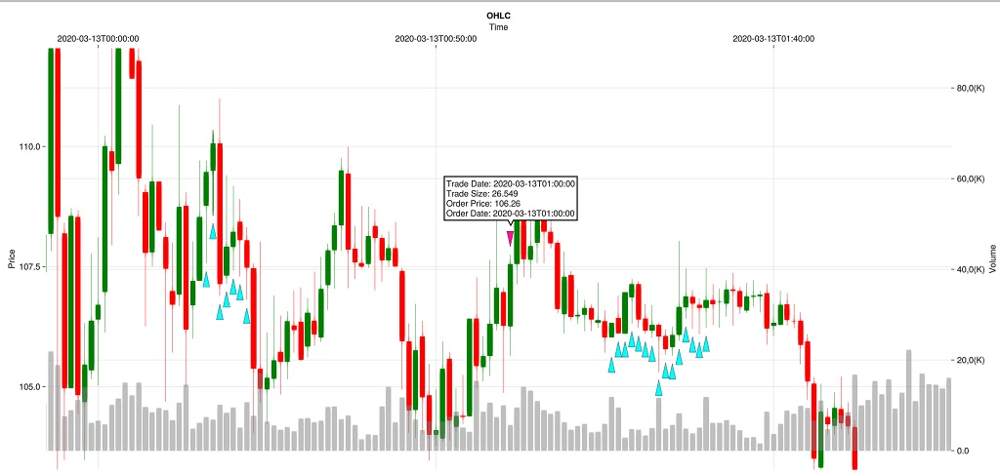
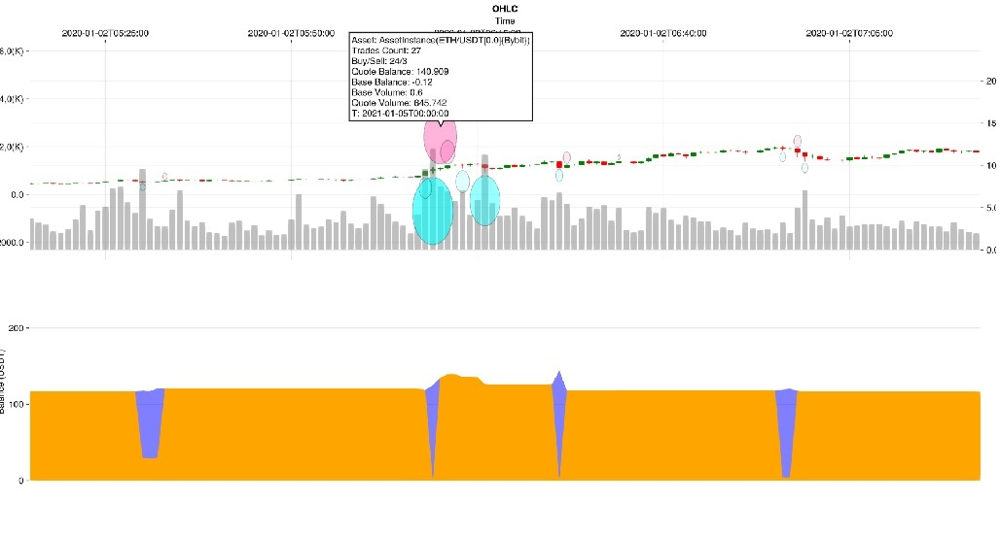
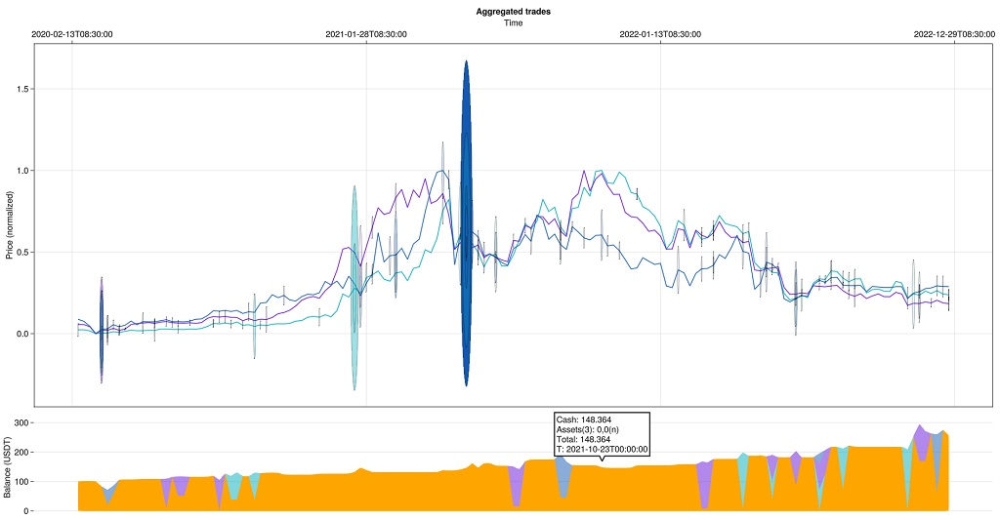
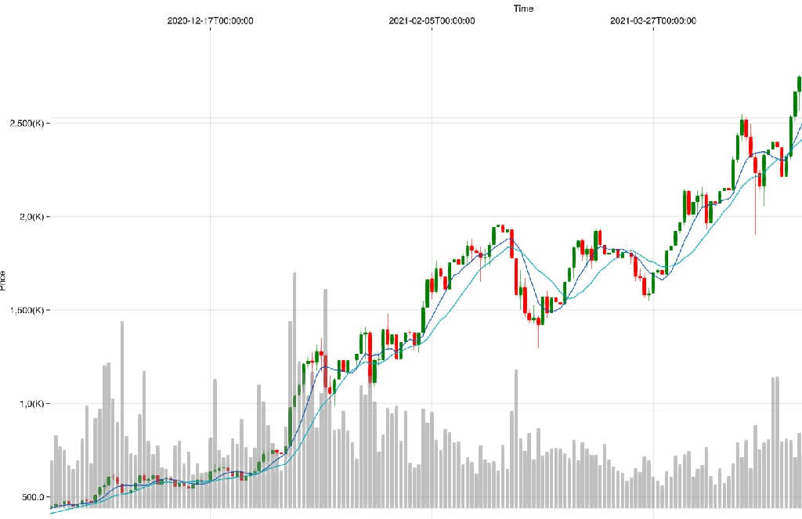
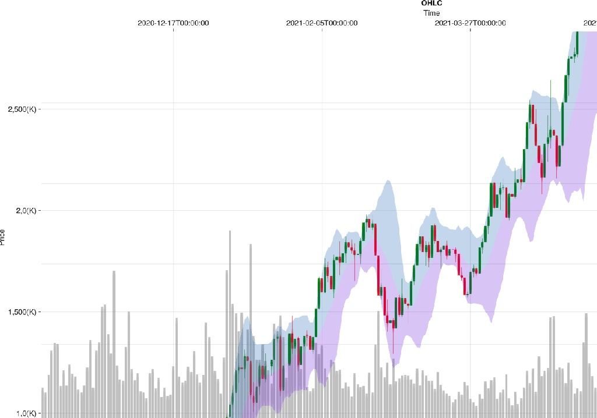

The Plotting module is based on [Makie](https://docs.makie.org/stable/). Backends are not included in the package dependencies so you need to add one yourself:

```julia
] add GLMakie
using GLMakie
# or
] add WGLMakie
using WGLMakie
```

PingPong provides recipes for plotting:

- OHLCV
- Fine grained trades history
- Aggregated trades history with volume and balance.

!!! info "Interactivity"
    Plots generated using makie interactive backends (GLMakie and WGLMakie) can be dragged and zoomed.
    There are tooltips (on hover) for candles, trades and balance plots.

#### OHLCV

We plot ohlcv data using candlesticks, colored in red/green, and volume bars in the background.
```julia
using Plotting
using Scrapers.BinanceData
df = binanceload("eth").data
fig = Plotting.ohlcv(df)
display(fig)
```


#### Trades history
We plot trades history as triangles pointing up for buys and down for sells.
```julia
using Lang
using Strategies
using Engine.Executors.SimMode: SimMode as bt
s = st.strategy(:Example)
ai = s.universe[m"eth"].instance
bt.backtest!(s)
# Plot the first 100 trades for the first asset matching symbol "eth"
fig = Plotting.tradesticks(s, m"eth", to=100)
display(fig)
```


#### Aggregated trades history for single asset

For a high level view of the trades density there is the `balloons` function. It aggregates all trades that have happened in a single timeframe. The bigger the circle the higher is the volume. Timeframes with positive volume are considered _sells_ and the opposite for _buys_. The less transparent the circle the more trades have happened in the timeframe. The plot at the bottom shows the balance, in quote currency held. The first band (orange) is actual cash (from `Strategy.cash`) while the other (blue) is the value of held assets in quote currency (`AssetInstance.cash * price`).

``` julia
# Aggreggate trades within 1 day for the first asset matching "eth".
Plotting.balloons(s, m"eth", tf=tf"1d")
```


#### Aggregated trades history for multiple assets
When plotting aggregated history for all strategy assets, we overlay balloons over the priceline of each asset.
Opacity and balloon radius properties are the same as for single asset plots. Alternatively passing a symbol or a dataframe as `benchmark` kwarg will plot all aggregations over that single asset OHLCV data.
``` julia
# Aggreggate trades within 1 day for all the assets in the strategy universe
Plotting.balloons(s, tf=tf"1w")
```



#### Custom indicators

For plotting a moving average we can use the `line_indicator` function.
``` julia
analyze!()
using Indicators
m7 = Indicators.sma(df.close, n=7)
m14 = Indicators.sma(df.close, n=14)
fig = Plotting.ohlcv(df);
fig = line_indicator!(fig, m7, m14)
display(fig)
```


For channels/envelopes we can use the `channel_indicator` function.

``` julia
bb = Indicators.bbands(df.close)
Plotting.channel_indicator(df, eachcol(bb)...)
```

